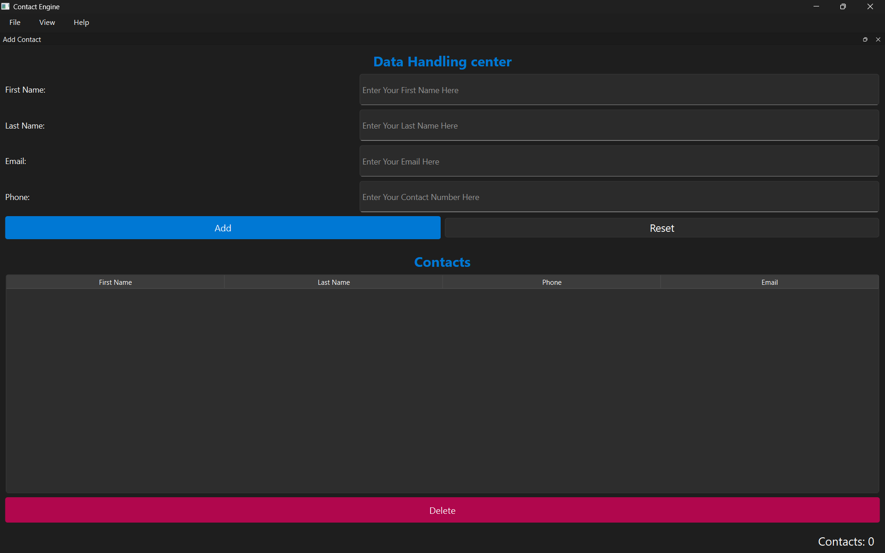

# My Phone Book

A small desktop contact manager built with **PySide6 (Qt for Python)**.
Add contacts through a form, view them in a list, delete them — and everything
persists to disk as JSON between sessions.



---

## Features

- Add contacts (first name, last name, phone, email)
- View all contacts in a scrollable list
- Multi-select and delete contacts
- Instant save on every change (add, delete) plus on close
- Graceful handling of missing or corrupted data files
- Dockable input form — move it, float it, close it, or toggle from the View menu
- Menu bar with keyboard shortcuts (`Ctrl+N`, `Ctrl+Q`)
- Status bar with live contact counter and action feedback

---

## Requirements

- Python 3.10+ (uses `list[Contact] | None` type hints)
- PySide6

Install:

```bash
pip install PySide6
```

---

## Running

```bash
python main.py
```

On first run, `contacts.json` is created automatically in the working directory.

---

## Project Structure

```
.
├── main.py            # entry point: builds app, loads/saves data, shows window
├── main_window.py     # QMainWindow: owns the book, panels, menus, docks, status
├── input_panel.py     # form for entering a new contact
├── list_panel.py      # scrollable list of contacts with delete
├── model.py           # Contact dataclass + ContactBook (data + JSON I/O)
└── contacts.json      # auto-generated data file
```

---

## Architecture

The app follows a simple **model / view / controller** split.

### `model.py` — the data

- **`Contact`** — a frozen dataclass holding `first_name`, `last_name`,
  `phone`, `email`. Rejects blank fields at construction time.
- **`ContactBook`** — holds a list of `Contact`s. Provides `add`, `remove`,
  `save`, and `load`. This is the **single source of truth** — no other
  part of the app stores contacts.

### `input_panel.py` — the form view

A `QWidget` with four `QLineEdit`s and Add / Reset buttons.
Emits one signal:

```python
contact_added = Signal(str, str, str, str)   # (first, last, phone, email)
```

It never touches the data. It emits; someone else decides what happens.

### `list_panel.py` — the list view

A `QWidget` with a `QListWidget` and a Delete button.
Emits one signal:

```python
delete_requested = Signal(list)   # list of selected row indices
```

Exposes one method:

```python
refresh(contacts)   # wipe and redraw the list from a snapshot
```

Like `InputPanel`, it holds no data of its own — it renders whatever it's
handed and forgets it.

### `main_window.py` — the controller

Owns the `ContactBook`, both panels, the menu bar, the status bar, and the
dock that wraps the input form. Its job is to wire everything together:

- When `InputPanel.contact_added` fires → add to book → refresh list → update counter → save.
- When `ContactListPanel.delete_requested` fires → remove from book → refresh list → update counter → save.

Both handlers follow the same pattern:

```
mutate the book  →  refresh the list  →  update status bar  →  save to disk
```

### `main.py` — the process

Loads the book from `contacts.json` at startup, hands it to `MainWindow`
along with the data path, and keeps a save-on-quit safety net. Knows nothing
about widgets.

---

## Layout

The window uses `QMainWindow` slots:

- **Central widget** — the contact list (always visible)
- **Top dock** — the input form (`QDockWidget` wrapping `InputPanel`)
- **Menu bar** — File (New Contact, Exit) / View (toggle input form) / Help (About)
- **Status bar** — permanent contact counter on the right, transient
  feedback messages on the left

The input dock is user-rearrangeable — drag it to any edge or float it as a
separate window. This is standard `QDockWidget` behavior, provided by Qt.

---

## Data Flow

```
User clicks Add
  → InputPanel emits contact_added(first, last, phone, email)
  → MainWindow._add_contact receives it
  → ContactBook.add(...)
  → ContactListPanel.refresh(book.contacts)
  → counter label updates, status message shows, book saved to disk

User selects rows and clicks Delete
  → ContactListPanel emits delete_requested([rows])
  → MainWindow._delete_contact iterates rows in DESCENDING order
  → ContactBook.remove(row) for each
  → ContactListPanel.refresh(book.contacts)
  → counter label updates, status message shows, book saved to disk
```

**Why descending order?** Deleting index 1 first shifts index 3 down to 2.
Iterating in reverse prevents deleting the wrong contact.

---

## Persistence

- **On startup:** `main.py` calls `book.load("contacts.json")`.
  - Missing file → treated as first run, file is created empty.
  - Corrupted file → warning dialog, app starts with an empty book.
- **After every mutation:** `MainWindow` saves the book immediately after
  add and delete, so a crash can't lose the last change.
- **On quit:** `app.aboutToQuit` saves again as a safety net.

The JSON format is a plain array of contact objects:

```json
[
  {
    "first_name": "Ada",
    "last_name": "Lovelace",
    "phone": "0123456789",
    "email": "ada@example.com"
  }
]
```

---

## Keyboard Shortcuts

| Shortcut | Action |
|---|---|
| `Ctrl+N` | Show the input dock and focus the first field |
| `Ctrl+Q` | Quit |

---

## Extending

The architecture is designed so features can be **added**, not **restructured**:

- **Click a row to edit** — store the full `Contact` on each list item via
  `UserRole`, emit an `edit_requested(Contact)` signal, populate the form.
- **Confirm before delete** — wrap the delete handler in a `QMessageBox.question`.
- **Search / filter** — add a `QLineEdit` in a right-side dock, filter before
  calling `refresh`.
- **Sort by name** — sort `book.contacts` before refreshing.

None of these require changing the model/view/controller boundaries.

---

## Versions

| Tag | Highlights |
|---|---|
| `v0.1` | Initial release — tabs layout, save on close |
| `v0.2` | Dock-based layout, menu bar, status bar, save on mutation |

---

## Known Limitations

- No search, sort, or edit yet (planned for later versions)
- Single file for all contacts (no multi-address-book support)
- Window layout is not remembered between sessions (dock position resets to top)
- Save failures show a warning dialog but the change stays in memory only

