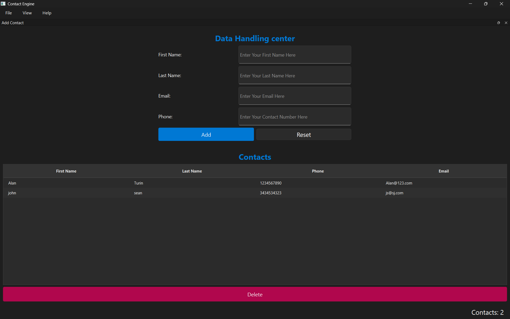

# Contact Engine

A small desktop contact manager built with **PySide6 (Qt for Python)**.
Add contacts through a form, view them in a sortable table, delete them — and
everything persists to a local SQLite database between sessions.



---

## Features

- Add contacts (first name, last name, phone, email)
- View all contacts in a sortable table (`QTableView`)
- Multi-select and delete contacts
- Instant persistence — every insert/delete is committed to SQLite immediately
- WAL mode for concurrent reads
- Indexed search columns (first name, last name, email)
- Dockable input form — move it, float it, close it, or toggle from the View menu
- Menu bar with keyboard shortcuts (`Ctrl+N`, `Ctrl+Q`)
- Status bar with live contact counter and action feedback

---

## Requirements

- Python 3.10+ (uses `list[Contact] | None` and `X | Y` type hints)
- PySide6

Install:

```bash
pip install PySide6
```

---

## Running

```bash
git clone https://github.com/Tharana-Dev/contact-engine.git
cd contact-engine
python main.py
```

On first run, `contacts.db` is created automatically in the working directory
with the schema and indexes applied.

---

## Project Structure

```
.
├── main.py            # entry point: builds app, opens DB, shows window
├── main_window.py     # QMainWindow: owns model, panels, menus, docks, status
├── input_panel.py     # form for entering a new contact
├── list_panel.py      # QTableView + Delete button
├── table_model.py     # ContactModel — QAbstractTableModel subclass
├── database.py        # SQLite connection, schema, and all SQL
├── contact.py         # Contact dataclass
├── style.qss          # application-wide stylesheet
└── contacts.db        # auto-generated SQLite database
```

---

## Architecture

The app follows a **model / view / controller** split, with a clean data layer
underneath.

### `contact.py` — the domain model

A single frozen dataclass:

- **`Contact`** — holds `id`, `first_name`, `last_name`, `phone`, `email`.
  Strips whitespace and rejects blank fields at construction time.

The `id` field is `int | None` — `None` before the contact is saved, and the
DB-assigned primary key afterward.

### `database.py` — the data layer

- **`Database`** — owns the SQLite connection. Enables WAL mode and
  `synchronous=NORMAL` on startup, creates the schema and indexes if missing.
  All SQL in the project lives here.

Methods:

```python
insert_contact(first, last, phone, email) -> Contact
fetch_all() -> list[Contact]
delete_contacts(ids: list[int]) -> None
close() -> None
```

No Qt. No display. Just SQL and `Contact` objects.

### `table_model.py` — the Qt view model

- **`ContactModel(QAbstractTableModel)`** — bridges `Database` and `QTableView`.
  Loads all contacts once at construction, then holds them in memory. Adds and
  removes go through the database first, then update the in-memory list with
  proper `beginInsertRows` / `endInsertRows` / `beginRemoveRows` /
  `endRemoveRows` signals so the view redraws correctly.

Public mutation methods:

```python
add_contact(first, last, phone, email) -> Contact
remove_contacts(rows: list[int]) -> None   # rows translated to ids internally
```

**Why rows vs ids matters:** the view talks in row indices (0, 1, 2, ...) but
the DB is keyed by id. `remove_contacts` translates — it maps each row to the
corresponding `Contact.id`, deletes by id in a single SQL statement, then
removes from the in-memory list iterating in descending order.

### `input_panel.py` — the form view

A `QWidget` with four `QLineEdit`s and Add / Reset buttons.
Emits one signal:

```python
contact_added = Signal(str, str, str, str)   # (first, last, phone, email)
```

It never touches the data. It emits; someone else decides what happens.

### `list_panel.py` — the table view

A `QWidget` with a `QTableView` and a Delete button. The panel is a dumb shell
— it doesn't hold data and doesn't refresh. It receives a `ContactModel` via
`set_model()`, and Qt handles all display updates through the model's signals.

Emits one signal:

```python
delete_requested = Signal(list)   # list of selected row indices
```

### `main_window.py` — the controller

Owns the `Database`, the `ContactModel`, both panels, the menu bar, the status
bar, and the dock that wraps the input form. Its job is to wire everything:

- When `InputPanel.contact_added` fires → `model.add_contact(...)` → update
  counter → status message.
- When `ContactListPanel.delete_requested` fires → `model.remove_contacts(rows)`
  → update counter → status message.

No refresh calls. The model emits the right signals and Qt redraws only what
changed.

### `main.py` — the process

Opens the `Database`, passes it to `MainWindow`, wires `db.close` to
`app.aboutToQuit`. Knows nothing about widgets.

---

## Layout

The window uses `QMainWindow` slots:

- **Central widget** — the contact table (always visible)
- **Top dock** — the input form (`QDockWidget` wrapping `InputPanel`)
- **Menu bar** — File (New Contact, Exit) / View (toggle input form) / Help (About)
- **Status bar** — permanent contact counter on the right, transient
  feedback messages on the left

The input dock is user-rearrangeable — drag it to any edge or float it as a
separate window.

---

## Data Flow

```
User clicks Add
  → InputPanel emits contact_added(first, last, phone, email)
  → MainWindow._add_contact receives it
  → ContactModel.add_contact(...)
      → Database.insert_contact(...)       (INSERT, returns Contact with id)
      → beginInsertRows / append / endInsertRows
  → counter label updates, status message shows

User selects rows and clicks Delete
  → ContactListPanel emits delete_requested([rows])
  → MainWindow._delete_contact receives it
  → ContactModel.remove_contacts(rows)
      → translate rows → ids
      → Database.delete_contacts(ids)      (single DELETE ... WHERE id IN (...))
      → for each row in descending order:
          beginRemoveRows / del / endRemoveRows
  → counter label updates, status message shows
```

**Why descending order?** Deleting row 1 first shifts row 5 down to row 4.
Iterating in reverse prevents deleting the wrong contact.

---

## Persistence

SQLite, not JSON.

- **On startup:** `Database.__init__` opens `contacts.db`, enables WAL mode,
  applies `synchronous=NORMAL`, and creates the table and indexes if missing.
  Idempotent — safe to run every launch.
- **On every mutation:** `ContactModel` calls `Database.insert_contact` or
  `Database.delete_contacts`, each wrapped in a transaction. The data hits disk
  immediately. A crash loses nothing.
- **On quit:** `db.close()` on `aboutToQuit` releases the connection cleanly.

The database schema:

```sql
CREATE TABLE Contacts (
    id          INTEGER PRIMARY KEY,
    first_name  TEXT,
    last_name   TEXT,
    phone       TEXT,
    email       TEXT
);

CREATE INDEX idx_contacts_first_name ON Contacts(first_name);
CREATE INDEX idx_contacts_last_name  ON Contacts(last_name);
CREATE INDEX idx_contacts_email      ON Contacts(email);
```

WAL mode enables concurrent reads while a write is in progress — relevant once
background sync lands in a later version.

---

## Keyboard Shortcuts

| Shortcut | Action |
|---|---|
| `Ctrl+N` | Show the input dock and focus the first field |
| `Ctrl+Q` | Quit |

---

## Extending

The architecture is designed so features can be **added**, not **restructured**:

- **Live search** — add a `QSortFilterProxyModel` between the model and the
  view, wire a `QLineEdit` to `setFilterFixedString`.
- **FTS5 fuzzy search** — add a virtual FTS5 table alongside the main table,
  query it with `MATCH`, populate the model from results.
- **Click a row to edit** — read `selectionModel().selectedRows()` in the
  panel, emit an `edit_requested(Contact)`, populate the form.
- **Confirm before delete** — wrap the delete handler in a `QMessageBox.question`.

None of these require changing the model/view/controller boundaries.

---

## Versions

| Tag | Highlights |
|---|---|
| `v0.1` | Initial release — tabs layout, save on close, JSON persistence |
| `v0.2` | Dock-based layout, menu bar, status bar, save on mutation |
| `v0.3` | Code structure cleanup and color palette |
| `v0.4` | SQLite persistence, `QAbstractTableModel`, `QTableView`, WAL mode |
| `v0.4.1` | Table styling pass, form layout fixes |

---

## Known Limitations

- No search, sort, or inline edit yet (planned for later versions)
- Single database file for all contacts (no multi-address-book support)
- Window layout is not remembered between sessions (dock position resets to top)
- No visual empty-state ("No contacts yet") — the table is simply blank

